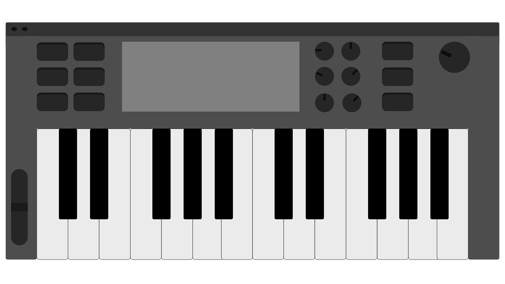

I made a simple python script to collect random samples of audio from the internet and spread them across my midi keyboard.

## Finding an audio source
YouTube is a rich source of audio content. The script generates a search term from two random English words and downloads search results using [pytube](https://github.com/get-pytube/pytube3).

~~~ python
def generate_keywords() -> List[str]:
    ''' return two random english words '''
    rw = RandomWords()
    words = rw.random_words()[0:1]
    return words  # ['polyrhythm', 'Handies Peak']

def search_youtube(keywords: List[str]):
    ''' return youtube links from provided keywords '''
    result = {}
    while not result:
        result = YoutubeSearch(
            ' '.join(keywords), max_results=10).to_dict()
        links = ['http://youtube.com/' + r['url_suffix'] for r in result]
    return links

def download_audio(links: List[str], output_path: str = None) -> None:
    ''' download audio from youtube link '''
    for link in links:
        try:
            yt = YouTube(link)
            yt.register_on_complete_callback(process_audio)
            yt.streams.filter(only_audio=True)[
                0].download(output_path=output_path)
        except:
            print(f'Could not download {link}')
~~~

## Slicing the audio
The script slices the audio up by detecting sound energy above a certain threshold using [Audiotok](https://github.com/amsehili/auditok).

~~~ python
def process_audio(stream: Stream, source_filepath: str) -> None:
    ''' function called upon download of audio '''
    audio_regions = split(source_filepath, energy_threshold=50,
                          max_dur=10, min_dur=1)
    os.remove(source_filepath)
    os.mkdir(source_filepath + '\\')
    for region in audio_regions:
        filename = region.save(source_filepath + "\\{meta.start:.3f}.wav")
        print("sample saved as: {}".format(filename))
~~~

## Putting it all together
The audio samples can be sent to your midi keyboard's audio sample directory using the `output-path` option. I've set mine to the 'samples' folder.

~~~ python
keywords = generate_keywords()
links = search_youtube(keywords)
download_audio(links[:2], output_path='samples')
~~~

The full source can be found on [Github](https://github.com/acjensen/yt-sampler).
