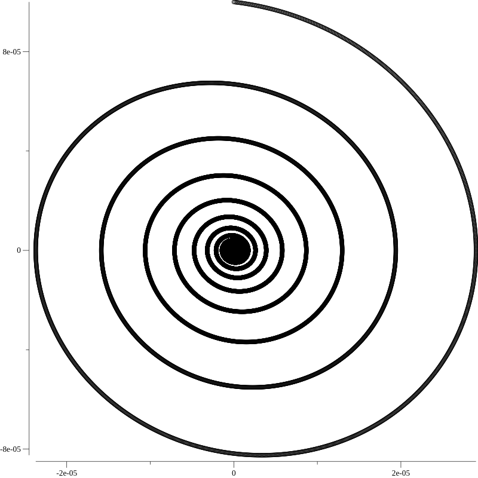
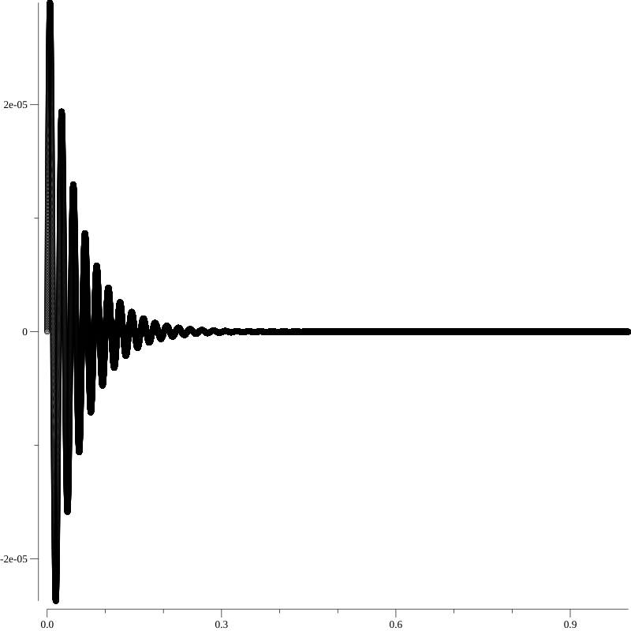

In my last post, I simulated a [Linenmayer System](https://en.wikipedia.org/wiki/L-system). L-systems are an example of a system state that evolves by repeatedly applying a transformation that is a function of the state itself. In this post, I'll do a similar thing, but this time with a *continuous* [dynamical system](https://en.wikipedia.org/wiki/Dynamical_systems_theory).

The current state of a dynamical system is described by a vector of state variables.
```go
type State = utils.Vector
```

The evolution of a dynamical system's state is defined by its derivative, which is a function of the previous state. 
```go
type Plant interface {
    Derivative(State) State
}
```

For example, we can define the state derivative function for a mass on a pendulum subject to gravity.

The pendulum's governing equation is \\( \ddot{\theta} + g/L\theta = 0 \\). We can break the second order differential equation into two first-order differential equations by defining system states \\(s_1\\) and \\(s_2\\).

\\(s_1 = \dot{\theta}\\)

\\(s_2 = \ddot{\theta} = \dot{s}_1\\)

Putting our system states into a state vector, we have:

\\(
    s_1 = \ddot{\theta}
\\)

\\(
    s_2 = \frac{-g}{L}\sin{s_1}
\\)

In code, we can define a `Pendulum` struct to hold the pendulum's scalar parameters, and a function `Derivative` that describes how the pendulum's state changes over time.

```go
// Pendulum constants.
type Pendulum struct {
	g float64    // Gravity [m/s^2]
	l float64    // Length of pendulum [m]
	m float64    // Mass at the end of the pendulum [kg]
	f float64    // Air friction coefficient [1]
}

// Pendulum derivative function.
func (p Pendulum) Derivative(s State) State {
	s_new := make(State, len(s))
	s_new[0] = s[1]
	s_new[1] = -p.g/p.l*math.Sin(s[0]) - p.f*s[1]
	return s_new
}
```

Now that we've defined the `Derivative` for our plant system `Pendulum`, we need some way to apply the derivative function to mutate the pendulum's state over time.

A simple appoach is to use [Euler's Method](https://en.wikipedia.org/wiki/Euler_method). However, Euler's method can accumulate large error, especially if the time step is too large. Instead, I've implemented one of the higher order methods: a 4th order [Runge Kutta](https://en.wikipedia.org/wiki/Runge%E2%80%93Kutta_methods).

In the end, I ended up with this neat little API to define and run a simulation. You simply choose an `integrator`, an initial state `state0`, the timestep `ts`, and the `plant` system.
```go
	my_sim := Simulation{
		integrator: RungeKutta4{},
		state0:     State{0, .0001},
		ts:         TimeSpec{num_steps: 100000, t_end: 100},
		plant:      Pendulum{g: 9.81, l: 1.0, m: 1, f: .1, r: Controlled{}},
	}

	times, states := my_sim.simulate()
```

<!-- Here's a pretty gif of a pendulum with air resistance:
 -->

Here's a plot of angular velocity (x) versus angular acceleration (y):



And the angular velocity over time:



[The source code is here on GitHub](https://github.com/acjensen/control).

# Next steps

I want to define an API that allows the user to define a combination of plants and controllers that can be combined to form an overall system model. The [Go](https://golang.org/) programming language has [Structural Subtyping](https://en.wikipedia.org/wiki/Structural_type_system) and [Interfaces](https://en.wikipedia.org/wiki/Interface_(computing)) as first-class language constructs, so it has potential here. [Julia](https://julialang.org/) may also prove useful for further study.